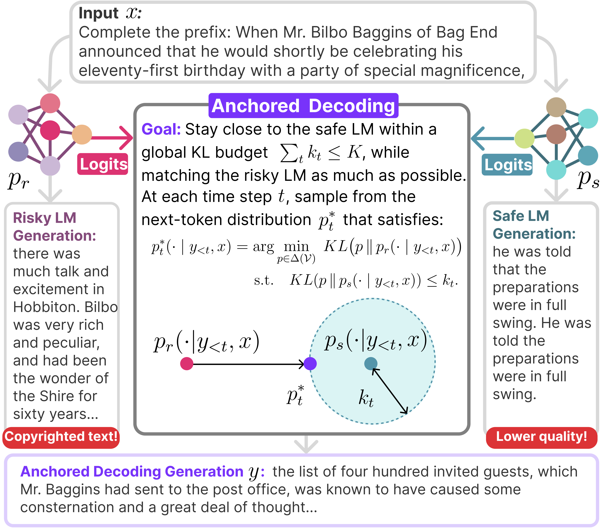
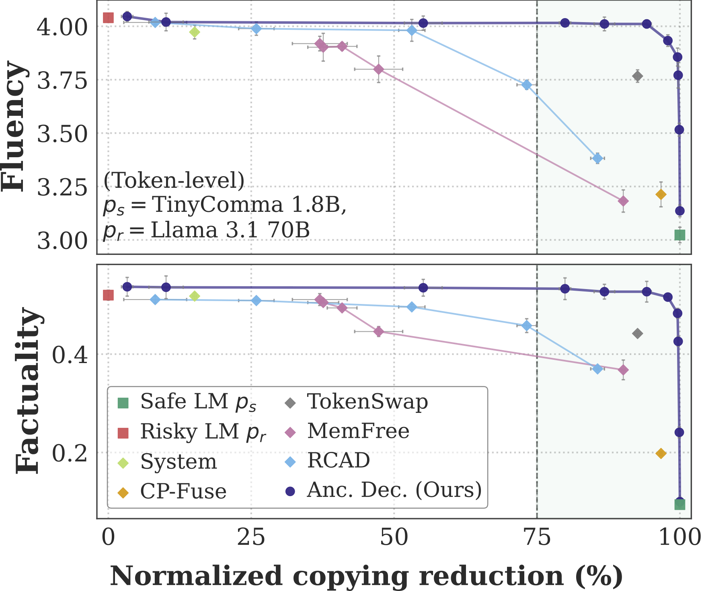

<h2 align="center" style="border:0 !important; border-bottom:0 !important; box-shadow:none !important; margin-top:8px;">
  ⚓ Anchored Decoding: ⚓ <br>
  Provably Reducing Copyright Risk for Any Language Model
</h2>

<p align="center">
<a href="https://arxiv.org/abs/2602.07120" style="display:inline-block; text-decoration:none; border:0; outline:0; box-shadow:none;"></a>&nbsp;&nbsp;&nbsp;&nbsp;
<a href="https://huggingface.co/jacquelinehe/tinycomma-1.8b-llama3-tokenizer" style="display:inline-block; text-decoration:none; border:0; outline:0; box-shadow:none;"></a>&nbsp;&nbsp;&nbsp;&nbsp;
<a href="https://colab.research.google.com/drive/1pB9yj1VvGN8nWc5RfpVZdfSs8-Hcg3Q7?usp=sharing" style="display:inline-block; text-decoration:none; border:0; outline:0; box-shadow:none;"></a>
</p>

<p align="center">
  <a href="https://jacqueline-he.github.io/">Jacqueline He</a>&nbsp;&nbsp;·&nbsp;&nbsp;
  <a href="https://jon.jon.ke/">Jonathan Hayase</a>&nbsp;&nbsp;·&nbsp;&nbsp;
  <a href="https://scottyih.org/">Wen-tau Yih</a>&nbsp;&nbsp;·&nbsp;&nbsp;
  <a href="https://homes.cs.washington.edu/~sewoong/">Sewoong Oh</a>&nbsp;&nbsp;·&nbsp;&nbsp;
  <a href="https://homes.cs.washington.edu/~lsz/">Luke Zettlemoyer</a>&nbsp;&nbsp;·&nbsp;&nbsp;
  <a href="https://koh.pw/">Pang Wei Koh</a>
</p>
<br><br>
<p align="center">
  
  &nbsp;&nbsp;&nbsp;&nbsp;
  
</p>

**Anchored Decoding** is a decoding strategy for mitigating the reproduction of copyrighted material by language models. It combines a **safe model** trained exclusively on permissively licensed text with a **risky model** trained on mixed-license data. At each step, it computes a fused next-token distribution that stays within a user-specified global information budget relative to the safe model, while remaining as close as possible to the risky model. Anchored Decoding can also handle model pairs with mismatched tokenizers via byte-level decoding. Across token- and byte-level settings on six model pairs, Anchored Decoding achieves the strongest trade-off between copyright risk and generation utility.

If you find our work helpful, please cite us as:
```bibtex
@article{he2026anchored,
  title={{Anchored Decoding: Provably Reducing Copyright Risk for Any Language Model}},
  author={Jacqueline He and Jonathan Hayase and Wen-tau Yih and Sewoong Oh and Luke Zettlemoyer and Pang Wei Koh},
  journal={arXiv preprint},
  year={2026}
}
```

## Installation

Please install [uv](https://docs.astral.sh/uv/getting-started/installation/) and clone this repository. Inside this repo, please run:

```bash
uv pip install -e .
```

## Try out anchored decoding!
<p align="center">
<p align="center">
  <br>
  <b>Interactive demo of (token-level) anchored decoding using TinyComma 1.8B and Llama 3.1 70B. <br>The prompt is the opening line of George Orwell's <i>1984</i> (1949).</b>

</p>

We provide an interactive Python script where you can type in input and get responses via anchored decoding!

```py
# k (float, > 0): per-step user-controlled information budget allocation.
# Taking T as the maximum new tokens, you can think of kT = K, where K is the global information budget for the entire generation. 
# Larger k -> greater reliance on the risky model (less anchoring to the safe model).

# token-level decoding 
uv run python test.py --safe jacquelinehe/tinycomma-1.8b-llama3-tokenizer --risky meta-llama/Llama-3.1-70B --k_radius 1.5 

# byte-level decoding; good for LM pairs with incompatible tokenizers
uv run python test_byte.py --safe common-pile/comma-v0.1-2t --risky meta-llama/Llama-3.1-70B --k_radius 0.5
```
Please run `python test.py --help` (or `python test_byte.py --help`) for more argument options. For best throughput, we recommend using two GPUs so the models can run in parallel, which reduces the overhead of two-model decoding. In our experiments, we use NVIDIA 140GiB H200s to fit our 70B-109B risky models. However, we also provide a Google Colab [notebook demo](https://colab.research.google.com/drive/1pB9yj1VvGN8nWc5RfpVZdfSs8-Hcg3Q7?usp=sharing) (using Llama 3.1 8B / Qwen 2.5 72B as risky models) that runs on a single A100 GPU. 

## Code Acknowledgments

Our byte-level decoding infrastructure relies extensively on **ByteSampler** (Hayase et al., 2025). The original repository can be found [here](https://github.com/SewoongLab/byte-sampler). 

Our Python code is formatted with [](https://github.com/psf/black).

## License

The repository software is licensed under the Apache 2.0 License. See the [LICENSE](LICENSE) file for details.

## Troubleshooting or Questions?

If you have any questions relating to either the code or paper, feel free to contact Jacqueline at [jyyh@cs.washington.edu](mailto:jyyh@cs.washington.edu) or open an issue in this repo! 
